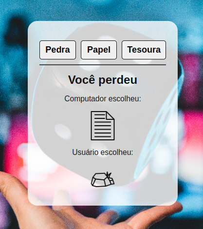

# projeto jogo pedra papel tesoura

O jogo pedra papel tesoura foi feito com HTML, CSS e JavaScript.
A principal missão do jogo é que o usuário escolha uma das três opções: pedra, papel ou tesoura. O jogo verifica a escolha do usuário e retorna a escolha do computador. O jogo termina quando um dos dois jogadores ganhar ou empatar.

